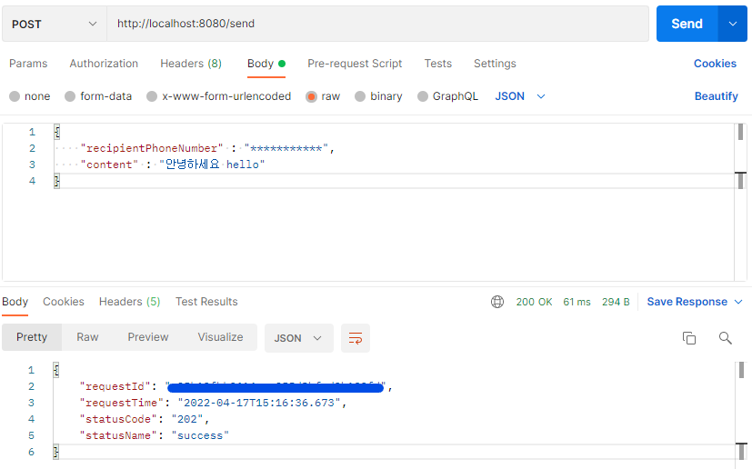

# ncloud SENS SMS 발송 API

> postman 프로그램을 통해서 문자 메시지 발송

- 프로젝트 형태 
  - Project: Maven Project
  - Language: Java 17
  - Spring Boot: 2.6.6
  - Packaging: Jar
  - Dependencies
    - Spring Web
    - MyBatis Framework
    - MySQL Driver
    - Apache HttpClient (https://mvnrepository.com/artifact/org.apache.httpcomponents/httpclient, 직접 추가)

- 주의 사항
  - git clone 시 src/main/resources/application.properties 수정 후 실행할 것